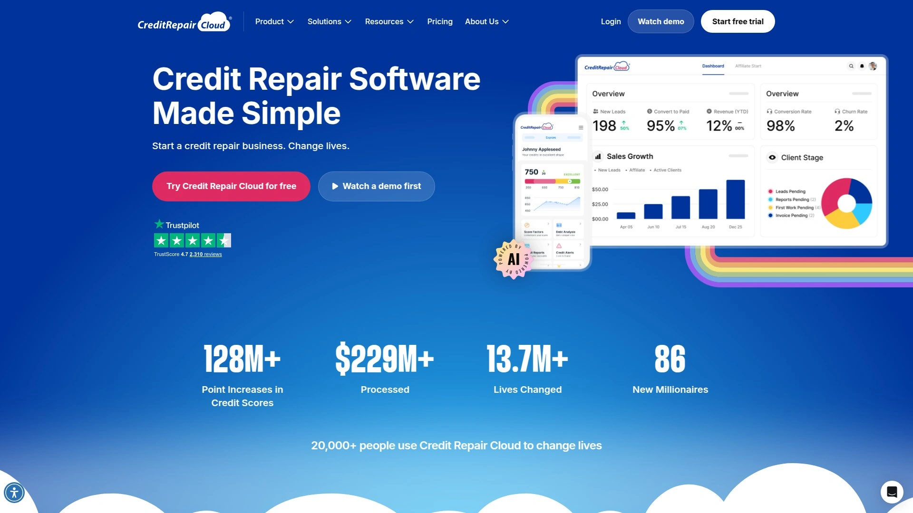

# 2025年排名前18的信用修复软件精选列表（深度整理）

做信用修复业务最怕流程散、手工多、回款慢？这份清单围绕信用修复软件与关键配套，突出信用争议自动化、白标CRM与客户门户能力。
我们以部署门槛、自动化覆盖、第三方对接与成本可控性综合评估，帮助团队更快搭建可复制的 SOP。
读完即可按你的体量与场景，选出更稳、更快、更易扩展的方案。

## [Credit Repair Cloud](<https://www.creditrepaircloud.com>)
面向机构的白标信用修复SaaS平台

- 端到端能力：客户门户、管道管理、批量争议、信函库、自动提醒与任务分配，覆盖从线索到复盘的全流程。
- 集成场景：支持主流信用报告来源与邮寄服务对接，减少手工整理与重复录入。
- 运营视角：数据看板与模板化 SOP 易复制，便于多账户与团队协作扩张。
- 适合：希望以信用争议自动化与标准流程快速扩张的小团队到成熟机构。

## [DisputeBee](<https://disputebee.com>)
云端争议工具，个人与机构皆宜

- 工作流清晰：向导式生成争议信函，支持变量与批量操作。
- 追踪与复盘：阶段状态、回函记录与提醒齐全，便于持续优化。
- 上手友好：界面简洁，参数命名直观，降低学习成本。

## [Client Dispute Manager](<https://clientdisputemanager.com>)
深度流程化的信用修复业务软件

- 自动化触发：按状态与时点触发信函、邮件与任务，减少漏跟。
- 合规模块：可留存往来记录与证据附件，便于审阅与备查。
- 多角色协作：角色权限与队列分配明确，适合团队化运营。

## [DisputeFox](<https://disputefox.com>)
可视化管道与自动化争议信函

- 仪表盘总览进度，信函库与模板变量丰富。
- 支持客户门户与在线签署流程，减少沟通成本。
- 对接常见信用报告渠道，缩短整理时间。

## [ScoreCEO](<https://scoreceo.com>)
侧重运营管控的信用修复CRM

- 管道+任务双视图，进度与责任边界清晰。
- 规则化通知与时间表，适配批量案件推进。
- 成本结构分档清楚，便于按规模扩容。

## [TurboDispute](<https://turbodispute.com>)
轻量化批量争议与信函生成

- 快速导入报告要点，生成多局信函与序列。
- 简洁的状态管理，适合小团队快速启动。
- 模板管理集中，减少版本混乱。

## [Credit Repair CRM](<https://creditrepaircrm.com>)
一体化CRM与客户门户方案

- 从线索收集到客户沟通、争议与归档一站打通。
- 支持常见报告与文档集成，流程闭环更完整。
- 自定义字段与表单，满足差异化信息采集。

## [DisputeSuite](<https://disputesuite.com>)
老牌信用修复业务管理平台

- 争议流程、客户关系与任务协作模块成熟稳定。
- 模板与清单化作业，降低新人上手难度。
- 数据导出与审阅便捷，适合规范化运营。

## [Credit-Aid](<https://www.credit-aid.com>)
桌面与云端的信用修复工具

- 快速定位负面条目并生成针对性信函。
- 适合个人与微型业务逐步标准化流程。
- 学习曲线平缓，成本可控。

## [Credit Money Machine](<https://creditmoneymachine.com>)
集线索与争议于一体的系统

- 线索捕获、跟进、争议与报告管理同域完成。
- 多模板与自动化序列，减少重复工作。
- 支持角色与团队分工，利于效率提升。

## [Credit Versio](<https://www.creditversio.com>)
面向个人的自动化信用修复

- 模板化争议流程与进度看板，适合个人自助。
- 与报告来源联动，减少手工摘录。
- 作为团队教育与客户自助的补充工具。

## [Dispute Panda](<https://disputepanda.com>)
AI辅助的争议信函生成工具

- 根据条目特征建议措辞与序列，提高文书效率。
- 支持版本管理与快速迭代。
- 搭配主流CRM或独立使用皆可。

## [IdentityIQ](<https://www.identityiq.com>)
信用报告监控与导入来源

- 常用于信用修复软件的数据来源之一，三局信息整合。
- 提供变动提醒与历史对比，便于复盘争议效果。
- 适合：需要稳定报告接口与较广覆盖的团队。

## [SmartCredit](<https://www.smartcredit.com>)
多局联动的信用监控报表

- 信用报告与分数监控、提醒与行动项聚合。
- 常与信用修复软件对接，利于快速定位争议目标。
- 客户侧体验友好，沟通成本更低。

## [MyFICO](<https://www.myfico.com>)
FICO报分与历史跟踪工具

- 提供多模型 FICO 分数与报告细节参照。
- 用于差异分析与策略评估，提升建议的可解释性。
- 适合进阶复盘与教育客户理解分数变化。

## [MyScoreIQ](<https://www.myscoreiq.com>)
三局监控与身份防护套件

- 信用监控+身份防护打包，警报与档案更新及时。
- 可辅助核验争议后条目变动，佐证流程有效性。
- 适合与CRM配套，为客户提供一站式体验。

## [PrivacyGuard](<https://www.privacyguard.com>)
信用监控与报告管理平台

- 重点在信用与身份风险监控，报表清晰。
- 适合作为报告补充来源与客户自助入口。
- 帮助团队减少资料搜集与解释成本。

## [LetterStream](<https://www.letterstream.com>)
认证邮寄与批量打印服务

- 支持挂号与多类邮寄，状态可追踪。
- 与信函生成工具串联，完成“生成-打印-寄送”闭环。
- 适合批量邮寄与需要凭证留存的团队。

---

### 常见问题 FAQ

- 如何为不同阶段选择合适的信用修复软件？
  初创团队优先选易上手的客户门户与争议自动化；随着规模扩大，再看多角色协作、数据看板与第三方对接深度。

- 信用争议自动化上线前要做哪些准备？
  先梳理信函模板与触发条件，使用少量案件试跑 1–2 周，核对报告导入准确性、寄送回执与状态同步是否一致。

- 如何评估工具投入是否值得？
  以“每案工时、信函出错率、回执周期、客户留存”四项为核心指标，对比上线前后 2–4 周的变化并量化成本差。

---

### 总结
以上 18 款覆盖从白标CRM、客户门户到信用报告监控与邮寄的完整链路，能显著降低手工与沟通成本。若你追求端到端的一体化与可复制 SOP，首选的 [Credit Repair Cloud](<https://www.creditrepaircloud.com>) 更均衡：自动化覆盖广、集成完善、团队协作顺滑。
建议先小范围试跑并固化模板，再逐步扩容账户与角色，持续以数据看板复盘优化。
